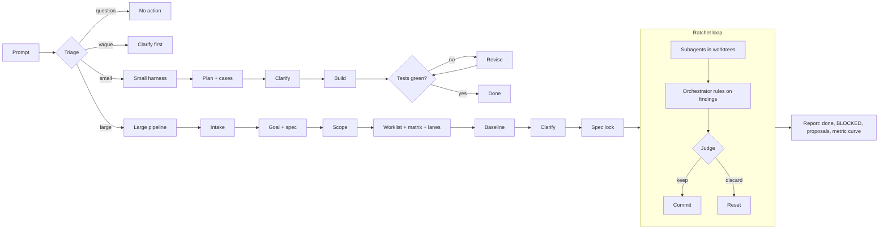

<p align="center">
  
</p>

<p align="center">
  <strong>A continuous engineering loop for Claude Code.</strong><br>
  Triage every request, run small tasks through a test-driven harness, and drive large tasks to a
  measurable goal with an orchestrator, parallel subagents, and a deterministic judge.
</p>

<p align="center">
  
  
  
  
  
</p>

---

## Overview

forge is a Claude Code plugin that turns a request into a loop that runs until the goal is met.
It takes the ratchet idea from [karpathy/autoresearch](https://github.com/karpathy/autoresearch)
(one change, one commit, one measurement, keep it or reset it) and wraps it in the engineering
process a real team uses: a written spec, a mapped scope, clarifying questions, a test matrix that
goes beyond the happy path, and a human sign-off before anything runs unattended.

The worker is always Claude. [Jev](https://typesafe.ai), TypeSafe's decision model, is used only where a
cheap, fast judgement helps: triage, model routing, finding pre-sorting, failure labelling, and
context compaction. Pass or fail is never decided by a model. It comes from test exit codes,
regression checks against a baseline, and a metric.

<table>
  <tr>
    <td width="33%" valign="top">
      <h3>Triage</h3>
      Every engineering prompt is classified as a question, a vague request that needs
      clarifying, a small task, or a large task, and routed to the matching flow.
    </td>
    <td width="33%" valign="top">
      <h3>Orchestrated goal loop</h3>
      Large tasks run as iterations of parallel subagents in their own git worktrees, an
      orchestrator that rules on findings by citing the spec, and a judge that keeps or resets.
    </td>
    <td width="33%" valign="top">
      <h3>Self-learning</h3>
      Repo-scoped instincts are distilled only from run evidence and owner corrections, then fed
      back into clarify and planning on the next task.
    </td>
  </tr>
</table>

**Plan → Build → Test → Improve → Learn**, repeated until the target is reached, the budget runs
out, progress stalls, or every remaining item needs a human decision.

## Table of contents

- [Key features](#key-features)
- [How it works](#how-it-works)
- [Requirements](#requirements)
- [Installation](#installation)
- [Configuration](#configuration)
- [Spec sources: Jira, Google Drive, Figma](#spec-sources-jira-google-drive-figma)
- [Verifying the setup](#verifying-the-setup)
- [Usage](#usage)
- [Workflows in detail](#workflows-in-detail)
- [Model routing and the model ladder](#model-routing-and-the-model-ladder)
- [Where Jev is used](#where-jev-is-used)
- [Function hooks (optional)](#function-hooks-optional)
- [Self-learning](#self-learning)
- [CLI reference](#cli-reference)
- [Project layout](#project-layout)
- [Testing](#testing)
- [Troubleshooting](#troubleshooting)
- [Known limitations](#known-limitations)
- [License and credits](#license-and-credits)

## Key features

- **Size and clarity triage** on every prompt, so vague requests are clarified before any code is
  written and large requests never start as a quick edit.
- **Small-task harness**: plan with happy, unhappy, and edge cases, clarify up front, build, and a
  `Stop` hook that keeps the session working until the tests are green (escalates after 3 revisions).
- **Large-task pipeline with hard gates**: intake from Jira, Google Docs, PDF, Markdown, PRD, or
  Figma, then goal and spec with a source for every acceptance criterion, a codebase-validated
  scope, a worklist, a test matrix, a measured baseline, detailed clarify, and an explicit spec lock.
- **Collision-free parallelism**: the subagent count is computed from the worklist (file overlaps,
  shared files, dependencies, free RAM, API quota) and offered to you during clarify. Each subagent
  may only write the files it owns.
- **Agnostic test coverage**: happy, unhappy, and edge cases per acceptance criterion, plus
  regression cases for every impacted path, compared against a baseline taken before any change.
- **Deterministic judge**: an iteration is kept only when nothing regressed, acceptance did not drop,
  the pre-existing suite stays green, and the metric or acceptance count improved. Otherwise `git reset`.
- **Spec-bound decisions**: findings during the loop go to the orchestrator, which must cite a real
  line of the spec, goal, clarify answers, or scope. Anything it cannot ground becomes **BLOCKED** and
  is reported to you at the end, while the loop continues with the remaining items.
- **Model ladder**: each item starts on the cheapest model Jev considers safe and climbs
  (Haiku → Sonnet 5.5 → Opus 5.5) when it fails the gate.
- **Safety rails**: locked evaluator files are hash-checked and edits to them are denied, irreversible
  commands are blocked, and forge never merges or pushes.

## How it works



## Requirements

| Requirement | Notes |
|---|---|
| Claude Code | 2.1.280 or newer (`claude --version`) |
| Claude Code login | `claude` then `/login`, or `ANTHROPIC_API_KEY`. Required for large tasks, since every subagent is a `claude -p` process |
| Node.js | 20 or newer. forge uses only Node built-ins, so there is no `npm install` |
| git | the target must be a git repository with at least one commit |
| Optional | `pdftotext` (poppler-utils) or `pymupdf` for PDF extraction; `hermes send` for Telegram reports |

## Installation

### Option A: from GitHub (recommended)

The repository is also a plugin marketplace (`.claude-plugin/marketplace.json`, named `forge-local`).

```bash
claude plugin marketplace add sudikama/forge
claude plugin install forge@forge-local
```

> [!NOTE]
> The repository is private. The machine must be able to clone `git@github.com:sudikama/forge.git`,
> either with an SSH key registered on GitHub or after `gh auth login`.

### Option B: from a local clone

```bash
git clone git@github.com:sudikama/forge.git ~/forge
claude plugin marketplace add ~/forge
claude plugin install forge@forge-local
```

### Option C: try it without installing

```bash
claude --plugin-dir ~/forge
```

The plugin is active for that session only.

### Installation scope

The default scope is `user` (all repositories). To enable forge for a single project, run from the
project root:

```bash
claude plugin marketplace add sudikama/forge --scope project
claude plugin install forge@forge-local --scope project
```

### `forge` CLI shim (optional)

Skills and slash commands call `node ${CLAUDE_PLUGIN_ROOT}/bin/forge.mjs`, so a shim is not required.
To call `forge` directly from a terminal:

```bash
node ~/forge/bin/forge.mjs doctor --install-shim   # writes ~/.local/bin/forge
```

With Option A the plugin lives in Claude Code's plugin cache (see `claude plugin list --json`), so a
local clone is the simplest base for the shim. Make sure `~/.local/bin` is on your `PATH`.

### Update and uninstall

```bash
claude plugin marketplace update forge-local
claude plugin update forge@forge-local
claude plugin uninstall forge@forge-local
```

Start a new Claude Code session after installing or updating so the hooks are loaded.

## Configuration

Settings can live in two places. Process environment wins over the file.

**Plugin userConfig** (stored in Claude Code settings):

```bash
claude plugin configure forge@forge-local
```

**`~/.forge/env`** (`KEY=value`, also read by the CLI outside Claude Code):

```bash
mkdir -p ~/.forge && chmod 700 ~/.forge
cat > ~/.forge/env <<'EOF'
FORGE_JEV_LANES=zen,commandcode
COMMANDCODE_API_KEY=
FORGE_MAX_WORKERS=4
EOF
chmod 600 ~/.forge/env
```

### Core

| Option | Default | Description |
|---|---|---|
| `jevLanes` / `FORGE_JEV_LANES` | `zen,commandcode` | Failover order of Jev backends: `zen` (opencode, free, keyless), `commandcode` (200 requests/day), `typesafe`, `openrouter` |
| `COMMANDCODE_API_KEY` | empty | Key for the commandcode lane |
| `TYPESAFE_API_KEY` | empty | Key for the typesafe lane (the only lane with calibrated confidence) |
| `OPENROUTER_API_KEY` | empty | Key for the openrouter lane (decisions API is in alpha) |
| `jevTimeoutMs` / `FORGE_JEV_TIMEOUT_MS` | 8000 | Per-lane timeout; on timeout the next lane is tried |
| `autoTriage` / `FORGE_AUTO_TRIAGE` | true | Triage every engineering prompt |
| `maxWorkers` / `FORGE_MAX_WORKERS` | 4 | Hard cap on parallel subagents |
| `FORGE_WORKER_MEM_MB` | 1200 | Estimated RAM per subagent; the worker count is also capped by free RAM |
| `smallMaxRevisions` / `FORGE_SMALL_MAX_REVISIONS` | 3 | Red test runs before the small harness escalates |
| `FORGE_VERIFIER_THRESHOLD` | 0.3 | Below this verifier score, a non-trivial request is treated as vague and must be clarified |
| `JIRA_BASE_URL`, `JIRA_EMAIL`, `JIRA_TOKEN` | empty | REST fallback when no Jira MCP is registered; also used for Jira report comments |
| `FORGE_HOME` | `~/.forge` | Global state: Jev circuit breaker, logs, instincts |

### Model routing and ladder

| Option | Default | Description |
|---|---|---|
| `routeAgents` / `FORGE_ROUTE_AGENTS` | true | Pick model and effort per loop agent (lanes and orchestrator) with Jev |
| `fastModel` / `balancedModel` / `deepModel` | `haiku` / `claude-sonnet-5-5` / `claude-opus-5-5` | Model for each tier and ladder rung. The default tier is balanced |
| `maxEffort` / `FORGE_MAX_EFFORT` | high | Highest effort routing may choose (`low`, `medium`, `high`, `xhigh`) |
| `minUpgradeConfidence` | 0.3 | Jev confidence needed to raise tier or effort |
| `minDowngradeConfidence` | 0.7 | Jev confidence needed to lower tier or effort |
| `ladderFailsFast` / `FORGE_LADDER_FAILS_FAST` | 1 | Gate failures on Haiku before the item moves to Sonnet 5.5 |
| `ladderFailsBalanced` / `FORGE_LADDER_FAILS_BALANCED` | 2 | Gate failures on Sonnet 5.5 before the item moves to Opus 5.5 |
| `ladderFailsDeep` / `FORGE_LADDER_FAILS_DEEP` | 2 | Gate failures on Opus 5.5 before the item is BLOCKED |

### Findings and compaction

| Option | Default | Description |
|---|---|---|
| `jevDecide` / `FORGE_JEV_DECIDE` | true | Let Jev reject a finding on its own when it matches an exclusion line in the spec |
| `jevRejectBar` / `FORGE_JEV_REJECT_BAR` | 0.6 | Minimum confidence for a Jev rejection |
| `jevCompaction` | true | Verbatim, Jev-guided compaction in interactive sessions (function hooks) |
| `compactAtPercent` | 60 | Context usage that triggers an automatic compaction (function hooks) |
| `minReductionRatio` | 0.25 | Below this reduction, the built-in summary is used instead |
| `compactionRefGuard` | true | Never drop a tool call whose file is still mentioned in the goal or later messages |
| `routeSessionSubagents` | true | Pick the model of Agent-tool subagents in interactive sessions (function hooks) |

Every Jev call fails open. If all lanes are down, forge falls back to deterministic rules and never
blocks the session.

## Spec sources: Jira, Google Drive, Figma

A large task always starts from a source. forge freezes a copy under `.forge/tasks/<KEY>/source/`
together with its hash. Claude reads the content through MCP and pipes it into
`forge source add --stdin`.

Register the MCP servers you use (examples; pick the servers you prefer):

```bash
# Jira: any MCP server that exposes get_issue
claude mcp add jira -- node /path/to/jira-mcp/dist/index.js

# Figma: Dev Mode remote MCP
claude mcp add --transport http figma https://mcp.figma.com/mcp

# Google Drive / Docs: an MCP server with OAuth; you complete the OAuth login yourself
claude mcp add gdrive -- npx -y <google-drive-mcp-package>

# Optional: impact analysis for scope.json
claude mcp add codebase-memory -- <codebase-memory server command>

claude mcp list
```

Without MCP:

| Source | Without MCP |
|---|---|
| Jira | `forge source add --kind jira --ref KEY` using `JIRA_*` from `~/.forge/env` |
| PDF | `forge source add --kind pdf --file x.pdf` (needs pdftotext or pymupdf), or let Claude read the PDF and pipe the text |
| Markdown / PRD | `forge source add --kind markdown --file path` or `--kind prd` |
| Google Doc / Figma | export to Markdown, then `--kind gdoc --ref <url> --stdin` or `--kind figma` |

## Verifying the setup

In Claude Code run `/forge:doctor`, or in a terminal:

```bash
forge doctor
```

A healthy result looks like this:

```
ok   claude code: 2.1.292 (Claude Code)
ok   claude auth (needed by loop agents): logged in
ok   jev lane zen: noul 0.19 in 1040ms
FAIL jev lane commandcode: COMMANDCODE_API_KEY not set
ok   jira mcp: registered
ok   forge on PATH: /home/you/.local/bin/forge
```

A `FAIL` for a lane without a key, or an MCP server you do not use, can be ignored. Large tasks need
`claude code`, `claude auth`, and `git` to be `ok`. At least one Jev lane should be `ok`; without one
forge still runs on deterministic fallbacks with coarser triage.

Quick triage check:

```bash
forge triage "add a money() helper that formats rupiah, with unit tests"
```

## Usage

Work in Claude Code as usual, inside a git repository. The `UserPromptSubmit` hook classifies each
prompt and injects instructions into the session:

| Triage result | What happens |
|---|---|
| `none` | a question or conversation; forge stays out of the way |
| `clarify` | the request has no checkable definition of done; Claude must ask first |
| `small` | the small harness (skill `forge-small`) |
| `large` | the large pipeline (skill `forge-large`); Claude may not write product code directly |

Slash commands:

| Command | Purpose |
|---|---|
| `/forge:start <request \| ticket KEY \| doc link>` | triage manually and start |
| `/forge:status` | state, failing gates, loop progress, BLOCKED items |
| `/forge:doctor` | check prerequisites |

## Workflows in detail

### Small tasks

1. **Plan**: `forge new KEY --mode small`, then a JSON plan (files, `test_cmd`, happy, unhappy, and
   edge cases) via `forge plan --stdin`. BUILD is refused without all three case kinds.
2. **Clarify**: open decisions are asked up front in a single batch.
3. **Build**: `forge phase BUILD`, then implement.
4. **Test, judge, revise**: when Claude ends a turn, the `Stop` hook runs every case and `test_cmd`.
   Red keeps the turn open and hands Claude the failing cases with a failure class. Green is done.
   Still red after 3 revisions escalates to you.
5. If the plan turns out to touch many files or modules, forge proposes promoting it to a large task.

### Large tasks

Every stage has a gate; `forge check` shows what is still missing.

1. **Intake**: ask where the final report goes and collect the source (Jira, Google Doc, PDF,
   Markdown, PRD, Figma).
2. **Goal and spec**: `goal.json` (test command, regression command, metric with direction and target,
   budget, editable and locked files) and `spec.md`, where every acceptance criterion carries
   `(source: ...)`.
3. **Codebase validation**: `scope.json` lists in-scope, impacted (with the tests covering them),
   out-of-scope, and conflicting items, each backed by `file:line` evidence.
4. **Worklist and test matrix**: vertical slices with owned files. The matrix needs happy, unhappy,
   and edge cases per criterion and a regression case per impacted path.
5. **Lanes**: `forge lanes` clusters items that collide on files, simulates 1 to N workers, and
   recommends the smallest count that is close to the fastest, within the hard cap, free RAM, and
   quota. Shared files (lockfiles, routers, migrations) belong to the orchestrator only.
6. **Baseline**: the matrix, suite, and metric run twice at `HEAD` to detect flaky tests.
7. **Clarify A to J**: goal, scope, requirements, testing, execution (subagent count and file
   ownership), budget, orchestrator authority, safety, reporting, and learned instincts.
8. **Spec lock**: only with explicit approval (`forge lock --approve`). Goal, spec, scope, matrix,
   baseline, and locked files are hashed, and edits to them are denied by a `PreToolUse` hook.
9. **Loop** (`forge run`, in the background). Each iteration:
   - every lane is a fresh `claude -p` in its own worktree and may only write its own files;
   - findings are reported with `forge finding`; the orchestrator rules on them by citing a line of
     the spec, goal, clarify answers, or scope. An invalid citation becomes BLOCKED, pre-existing bugs
     and refactor ideas become ticket proposals, and BLOCKED items are skipped while the loop goes on;
   - the judge keeps the iteration only if nothing regressed against the baseline, acceptance did not
     drop, the pre-existing suite is green, and acceptance or the metric improved. Otherwise `git reset`;
   - the loop stops when the target is reached, the iteration or time budget is spent, N iterations
     pass without progress, every remaining item is BLOCKED, or you run `forge stop`.
10. **Report**: `report.md` covers finished items, BLOCKED items with questions and options, ticket
    proposals, orchestrator decisions, model routing, the metric curve, and learned instincts. It is
    delivered to the targets chosen at intake. forge never merges or pushes.

## Model routing and the model ladder

Every loop agent is a fresh `claude -p` process, so switching models costs no prompt cache. Jev picks
the **starting** tier and effort for each lane. Spending more needs little confidence (0.3), spending
less needs a lot (0.7). L-sized items never start on the fast tier, and the orchestrator never runs
below Sonnet 5.5 with medium effort.

After an item has been through the gate, its rung on the ladder decides the model:

| Tier | Default model | Gate failures before moving up | Next |
|---|---|---|---|
| fast | Haiku | 1 | Sonnet 5.5 |
| balanced | Sonnet 5.5 | 2 | Opus 5.5 |
| deep | Opus 5.5 | 2 | BLOCKED, listed in the report |

- **A gate failure** is any of: the item's own matrix cases are red; its lane was rejected (it touched
  a locked file or wrote outside its ownership); a merge conflict; no change produced; or a regression
  proven to come from that lane.
- **Regression attribution**: when a shared check goes red, forge re-runs the failing regression checks
  in each merged lane's worktree on its own. Only a lane that is red by itself is blamed. Green items
  discarded because of another lane are recorded as *not counted*.
- Passing never moves an item down. Retries on Sonnet use at least medium effort; Opus always uses high.
- When Opus also runs out of attempts, the item becomes BLOCKED with every attempt (iteration and
  model) as evidence and three options: split or clarify the item, change the spec, or fix it by hand.
- The history is in the **Model ladder** section of `report.md` and the `routes` column of
  `results.tsv` (retries are marked `#r1`).

## Where Jev is used

| Point | What Jev does | Deterministic guard |
|---|---|---|
| Prompt triage | engineering or not, size, parallelism, presence of a verifier | a low verifier score forces clarify |
| Loop agent routing | starting tier and effort per lane and orchestrator | asymmetric confidence; ladder takes over after the first gate; orchestrator floor; effort cap |
| Finding decisions | maps a finding to a Non-goals, MUST NOT, or out-of-scope line | rejects only above `jevRejectBar` with a valid citation; everything else goes to the Claude orchestrator |
| Failure classification | labels why tests failed, to steer the next revision | never affects the verdict |
| Session compaction | scores which tool calls are still needed | reference guard keeps files still in use; falls back to the built-in summary below `minReductionRatio` or on error |
| Session subagents | picks the model of Agent-tool subagents | forks and explicitly chosen models are left untouched |

## Function hooks (optional)

Jev compaction, automatic compaction, and session subagent routing live in `hooks/forge-fn.js`. The
module is only loaded when Claude Code runs with:

```bash
export CLAUDE_CODE_ENABLE_FUNCTION_HOOKS=1
```

Without the flag, the classic hooks (triage, gate, small harness) and loop agent routing work as usual.

> [!WARNING]
> The function hooks API is in early access and may change between Claude Code releases.

## Self-learning

Repo-scoped instincts are stored in `~/.forge/learn/repos/<repo>/`, in the same format as
hermes-squad instincts (squad instincts are read-only). They come only from run evidence: test
commands proven green, recurring errors that were eventually resolved, cases that caught a real
regression, and owner corrections (`forge answer ... --correction "..."`).

Confidence starts at 0.5, rises by 0.1 when confirmed, drops by 0.2 when contradicted, and the instinct
is removed below 0.4. Changes to forge's own templates, prompts, or code are only ever proposed in the
report, never applied automatically.

## CLI reference

```
forge doctor [--install-shim]          check prerequisites
forge triage "<request>"               size and clarity triage
forge new <KEY> --mode small|large --title ".." --report-to telegram:CHAT:THREAD,jira:KEY,file
forge source add --kind jira|gdoc|pdf|markdown|prd|figma|file (--ref X | --file P | --stdin)
forge template goal|spec|scope|matrix|worklist [--write]
forge check                            validate artifacts, advance state, show the next step
forge lanes                            recommend the subagent count
forge baseline [--force]               measure the baseline at HEAD
forge clarify [--json]                 numbered clarify questions
forge answer <ID> "<answer>" [--correction "<lesson>"]
forge lock --approve                   spec lock
forge run [--foreground]               start the loop
forge status | pause | stop | resume
forge finding --kind K --title T --evidence E [--item W1] [--options "a|b"]
forge findings | report [--regenerate]
forge plan --stdin | phase PLAN|CLARIFY|BUILD|TEST     (small tasks)
forge learn list | correct "<text>" | contradict <id>
forge use <KEY> | list
```

Report targets: `telegram` (home channel) or `telegram:<chat_id>[:<thread_id>]` via `hermes send`,
`jira:<KEY>` (comment), and `file` (only `report.md`).

## Project layout

```
.claude-plugin/plugin.json        manifest and userConfig
.claude-plugin/marketplace.json   forge-local marketplace
hooks/hooks.json                  SessionStart, UserPromptSubmit, PreToolUse, Stop, forge-fn.js module
hooks/forge-fn.js                 function hooks: Jev compaction, auto-compact, session subagent routing
hooks/vendor/fast-jev/            vendored fast-jev-compaction (MIT)
bin/forge.mjs                     single CLI used by hooks, skills, and lanes
lib/                              jev, triage, route, task, lanes, judge, runner, small, clarify, learn, io, report, hooks
skills/                           forge, forge-small, forge-large instructions for Claude
commands/                         /forge:start, /forge:status, /forge:doctor
templates/                        goal, spec, scope, worklist, matrix, lane and orchestrator prompts
tests/                            unit tests, end-to-end fixture, stub agent, Jev mock
docs/assets/                      README artwork
```

In the target repository, forge writes to `.forge/` (added to `.git/info/exclude` automatically):

```
.forge/active                     active task
.forge/tasks/<KEY>/               task.json, source/, goal.json, spec.md, scope.json,
                                  worklist.json, matrix.json, lanes.json, baseline.json,
                                  clarify.json, decisions.md, findings/, decisions/,
                                  agents/ (prompt and log per agent), iterations/,
                                  results.tsv, ledger.md, report.md
.forge/wt/<KEY>/                  worktrees: integ, lane-a, lane-b, ...
```

Loop branches: `forge/<KEY>` (best result) and `forge/<KEY>-lane-<x>`.

## Testing

```bash
bash tests/e2e/run-large.sh           # full large flow with a stub agent (deterministic, no cost)
bash tests/e2e/run-small.sh           # small harness, lane gate, live triage on Jev zen
node tests/unit/route.test.mjs        # routing policy, model ladder, Jev finding decisions (mock lane)
node tests/unit/forge-fn.test.mjs     # function hooks on a fake engine; LIVE=1 also hits the zen lane
```

`run-large.sh` replaces `claude -p` with a scripted stub through `FORGE_AGENT_CMD` and verifies:

- every stage gate, and that the lock needs explicit approval;
- an iteration with a regression is discarded, and a lane that touches a locked file is rejected;
- orchestrator decisions with valid citations, invalid citations becoming BLOCKED, ticket proposals;
- the report contents, and instincts carried into the next task's clarify;
- per-lane model routing, Haiku escalating to Sonnet 5.5 after one failure, regression attribution by
  isolated re-runs, and an always-broken item climbing Haiku → Sonnet 5.5 → Opus 5.5 → BLOCKED;
- Non-goal findings rejected by Jev without spawning the orchestrator;
- the base branch is never touched.

## Troubleshooting

| Symptom | Cause and fix |
|---|---|
| Hooks do not run | start a new session after installing; check `claude plugin list` |
| `claude auth: not logged in` | run `claude` then `/login`, or set `ANTHROPIC_API_KEY` |
| Jev lane returns `HTTP 403` | Cloudflare; forge already sends a browser User-Agent. Retry or switch lanes |
| commandcode lane closed for an hour | the daily quota is spent; the circuit breaker reopens automatically |
| `cannot lock, gates still failing` | run `forge check` and fix the listed items |
| `baseline ran at X but HEAD is Y` | a commit landed after the baseline; run `forge baseline` again |
| `new-behaviour case already green at baseline` | the acceptance test does not exercise the new behaviour; fix the test |
| Loop stops with `every remaining item is blocked` | answer the BLOCKED items in `report.md`, update spec or clarify, then open a follow-up task |
| Only one worker despite many items | low free RAM or file collisions; see `forge lanes` |
| Logs | `~/.forge/logs/hooks.jsonl`, `~/.forge/logs/jev.jsonl`, `.forge/tasks/<KEY>/runner.log` |

## Known limitations

- The large loop is verified end to end with a stub agent. Runs with real `claude -p` agents depend on
  a logged-in Claude Code on that machine.
- Jev compaction and session subagent routing are tested on a fake engine plus the live zen lane, not
  yet inside a real Claude Code session.
- The zen lane's confidence is not calibrated. In probes it scored the file under edit at 0.17, which
  is why the reference guard exists. Jev rejections of findings are rare on zen (true matches score
  0.40 to 0.49, below the 0.6 bar), so most findings still go to the Claude orchestrator.
- Per-turn effort routing in interactive sessions (jev-effort style) is not implemented; jev-effort's
  own data shows a small benefit.
- Triage thresholds are calibrated on a small sample. Use `forge triage` to check a request that seems
  misclassified.
- Regression detection is only as strong as the existing tests plus the characterization tests written
  at baseline.

## License and credits

Released under the MIT license, as declared in `.claude-plugin/plugin.json`.

Built on ideas and code from:

- [karpathy/autoresearch](https://github.com/karpathy/autoresearch): the keep-or-reset ratchet loop.
- [tamaratran/fast-jev-compaction](https://github.com/tamaratran/fast-jev-compaction): vendored in
  `hooks/vendor/fast-jev/` under its MIT license.
- [moelahmady/jev-model-router](https://github.com/moelahmady/jev-model-router),
  [ifoster01/jev-effort](https://github.com/ifoster01/jev-effort), and
  [shitianfang/jev-use](https://github.com/shitianfang/jev-use): routing, effort, and tool-gating
  patterns.
