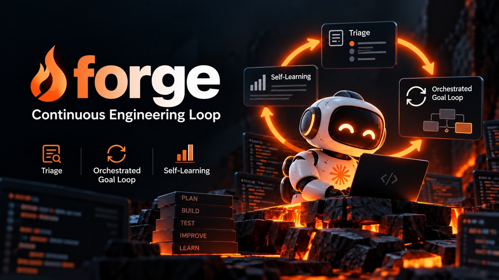
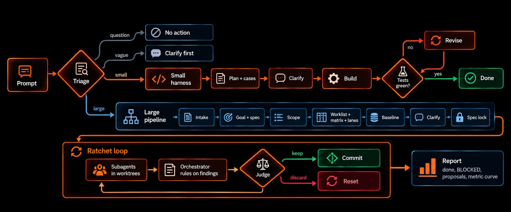

<p align="center">
  
</p>

<p align="center">
  <strong>A continuous engineering loop for Claude Code.</strong><br>
  Triage every request, run small tasks through a test-driven harness, and drive large tasks to a
  measurable goal with an orchestrator, parallel subagents, and a deterministic judge.
</p>

<p align="center">
  
  
  
  
  
</p>

---

forge takes the ratchet idea from [karpathy/autoresearch](https://github.com/karpathy/autoresearch)
(one change, one commit, one measurement, keep it or reset it) and wraps it in the process a real
team follows: a written spec, a mapped scope, clarifying questions, tests beyond the happy path, and
a human sign-off before anything runs unattended.

The worker is always Claude. [Jev](https://typesafe.ai), TypeSafe's decision model, only makes cheap,
fast judgements: triage, model routing, finding pre-sorting, failure labelling, and context
compaction. Pass or fail always comes from test exit codes, a baseline, and a metric.

<table>
  <tr>
    <td width="33%" valign="top">
      <h3>Triage</h3>
      Each engineering prompt is classified as a question, a vague request, a small task, or a
      large task, and routed to the matching flow.
    </td>
    <td width="33%" valign="top">
      <h3>Orchestrated goal loop</h3>
      Parallel subagents in their own worktrees, an orchestrator that rules on findings by citing
      the spec, and a judge that keeps or resets each iteration.
    </td>
    <td width="33%" valign="top">
      <h3>Self-learning</h3>
      Repo-scoped instincts distilled from run evidence and owner corrections, fed back into the
      next task.
    </td>
  </tr>
</table>

## Contents

- [How it works](#how-it-works)
- [Quick start](#quick-start)
- [Configuration](#configuration)
- [Spec sources](#spec-sources)
- [Model routing](#model-routing)
- [Self-learning](#self-learning)
- [CLI reference](#cli-reference)
- [Development](#development)
- [Troubleshooting](#troubleshooting)
- [Known limitations](#known-limitations)
- [License and credits](#license-and-credits)

## How it works

<p align="center">
  
</p>

### Small tasks

Plan with happy, unhappy, and edge cases, clarify open decisions up front, then build. When Claude
ends a turn, a `Stop` hook runs the cases and the test command: red keeps the session working with the
failing cases attached, green is done, and three red revisions escalate to you. A plan that grows past
a few files is proposed for promotion to a large task.

### Large tasks

Every stage has a gate, and `forge check` tells you what is missing.

| Stage | Output |
|---|---|
| Intake | frozen copy of the source (Jira, Google Doc, PDF, Markdown, PRD, Figma) and the report target |
| Goal and spec | `goal.json` (test and regression commands, metric, target, budget, locked files) and `spec.md`, with a source for every acceptance criterion |
| Scope | `scope.json`: in scope, impacted, out of scope, and conflicts, each with `file:line` evidence |
| Worklist and matrix | vertical slices with owned files; happy, unhappy, and edge cases per criterion plus a regression case per impacted path |
| Lanes | subagent count computed from file collisions, dependencies, free RAM, and quota; shared files belong to the orchestrator |
| Baseline | matrix, suite, and metric measured twice at `HEAD` to catch flaky tests |
| Clarify | numbered questions A to J, each with a recommendation, including the subagent count |
| Spec lock | explicit approval; artifacts and evaluator files are hashed, and edits to them are denied |

Then the loop runs in the background. Each iteration:

- every lane is a fresh `claude -p` in its own git worktree and may only write the files it owns;
- findings go to the orchestrator, which must cite a real line of the spec, goal, clarify answers, or
  scope. Anything it cannot ground becomes **BLOCKED**, and the loop continues with the other items;
- the judge keeps the iteration only if nothing regressed, acceptance did not drop, the pre-existing
  suite is green, and acceptance or the metric improved. Otherwise it runs `git reset`.

The loop stops when the target is reached, the budget is spent, progress stalls, or every remaining
item is BLOCKED. `report.md` lists finished work, BLOCKED items with questions and options, ticket
proposals, decisions, model usage, and the metric curve. forge never merges or pushes.

## Quick start

**Requirements:** Claude Code 2.1.280+ (logged in), Node.js 20+, and git. There are no npm dependencies.

```bash
claude plugin marketplace add sudikama/forge
claude plugin install forge@forge-local
```

Open a new Claude Code session inside a git repository and run `/forge:doctor`. Claude Code, auth,
and git must be `ok`. Jev lanes without a key show `FAIL` and can be ignored as long as one lane
works; without any, forge falls back to deterministic rules.

Then work as usual. Every prompt is triaged automatically:

| Triage | What happens |
|---|---|
| `none` | a question or conversation; forge stays out of the way |
| `clarify` | no checkable definition of done; Claude asks before writing code |
| `small` | small harness |
| `large` | large pipeline; Claude may not write product code directly |

| Command | Purpose |
|---|---|
| `/forge:start <request \| ticket \| doc link>` | triage manually and start |
| `/forge:status` | state, failing gates, loop progress, BLOCKED items |
| `/forge:doctor` | check prerequisites |

To update, run `claude plugin marketplace update forge-local && claude plugin update forge@forge-local`.

## Configuration

Set options with `/plugin configure forge@forge-local` inside Claude Code, or in `~/.forge/env` as
`FORGE_<OPTION>=value` (for example `FORGE_MAX_WORKERS=2`; API keys keep their own names). The process
environment wins over the file. `claude plugin configure forge@forge-local` lists the current values.

| Option | Default | Description |
|---|---|---|
| `jevLanes` | `zen,commandcode` | Jev backend failover order: `zen` (free, keyless), `commandcode` (200 requests/day), `typesafe`, `openrouter` |
| `COMMANDCODE_API_KEY`, `TYPESAFE_API_KEY`, `OPENROUTER_API_KEY` | empty | Keys for the matching lanes; typesafe is the only lane with calibrated confidence |
| `autoTriage` | true | Triage every engineering prompt |
| `maxWorkers` | 4 | Hard cap on parallel subagents (also capped by free RAM, about 1.2 GB each) |
| `smallMaxRevisions` | 3 | Red test runs before the small harness escalates |
| `fastModel`, `balancedModel`, `deepModel` | `haiku`, `claude-sonnet-5-5`, `claude-opus-5-5` | Model per tier |
| `ladderFailsFast`, `ladderFailsBalanced`, `ladderFailsDeep` | 1, 2, 2 | Gate failures allowed on each tier before moving up, or before BLOCKED on the top tier |
| `maxEffort` | high | Highest effort routing may pick |
| `jevDecide`, `jevRejectBar` | true, 0.6 | Let Jev reject a finding that matches a spec exclusion line with at least this confidence |
| `jevCompaction`, `compactAtPercent` | true, 60 | Jev-guided compaction and its trigger (function hooks only) |
| `JIRA_BASE_URL`, `JIRA_EMAIL`, `JIRA_TOKEN` | empty | Jira REST fallback when no Jira MCP is registered |
| `reportCmd` | empty | Shell command for the `command` report target |
| `extraInstincts` | empty | Optional read-only instinct store (same `<repo>/*.yaml` layout) merged into prompts |

The full list with descriptions lives in [`.claude-plugin/plugin.json`](.claude-plugin/plugin.json).
Every Jev call fails open, so an outage never blocks a session.

## Spec sources

Large tasks read their source through MCP and freeze a hashed copy under `.forge/tasks/<KEY>/source/`.
Register the servers you use:

```bash
claude mcp add jira -- <any Jira MCP server exposing get_issue>
claude mcp add --transport http figma https://mcp.figma.com/mcp
claude mcp add gdrive -- <a Google Drive MCP server with OAuth>
```

Without MCP, `forge source add` accepts a Jira key (REST fallback), a PDF, a Markdown or PRD file, or
any text piped on `--stdin`.

## Model routing

Each loop agent is a fresh `claude -p`, so switching models costs no prompt cache. Jev picks the
starting tier and effort per lane: raising them needs 0.3 confidence, lowering them needs 0.7. L-sized
items never start on Haiku, and the orchestrator never runs below Sonnet 5.5.

From then on, the gate moves each item up a model ladder:

| Tier | Model | Failures allowed | Then |
|---|---|---|---|
| fast | Haiku | 1 | Sonnet 5.5 |
| balanced | Sonnet 5.5 | 2 | Opus 5.5 |
| deep | Opus 5.5 | 2 | BLOCKED, with every attempt as evidence |

A failure is a red case owned by the item, a rejected or unmergeable lane, or a regression proven to
come from that lane. When a shared check goes red, forge re-runs it in each lane's worktree on its own,
so only the lane that breaks it is blamed. Passing never moves an item down.

<details>
<summary>Where else Jev is used</summary>

| Point | What Jev does | Guard |
|---|---|---|
| Triage | size, parallelism, presence of a verifier | a low verifier score forces clarify |
| Findings | maps a finding to a Non-goals, MUST NOT, or out-of-scope line | rejects only above `jevRejectBar` with a valid citation |
| Failures | labels why tests failed, to steer the next revision | never affects the verdict |
| Compaction | scores which tool calls are still needed | files still referenced are kept; falls back to the built-in summary |
| Session subagents | picks the model of Agent-tool subagents | explicit models and forks are untouched |

Compaction and session subagent routing are function hooks (`hooks/forge-fn.js`). They load only with
`CLAUDE_CODE_ENABLE_FUNCTION_HOOKS=1`, an early-access API that may change between releases.

</details>

## Self-learning

Instincts are stored per repository in `~/.forge/learn/repos/<repo>/` and come only from run
evidence: test commands proven green, recurring errors that were resolved, cases that caught a real
regression, and your corrections (`forge answer <ID> "<answer>" --correction "<lesson>"`). Confidence
starts at 0.5, rises 0.1 when confirmed, drops 0.2 when contradicted, and the instinct is dropped below
0.4. Changes to forge itself are only proposed in the report, never applied automatically.

## CLI reference

Skills and hooks drive the CLI for you; these commands are useful directly. Run
`node bin/forge.mjs doctor --install-shim` from a clone to put `forge` on your `PATH`.

```
forge doctor | triage "<request>"
forge new <KEY> --mode small|large --title ".." --report-to file|jira:KEY|webhook:URL|command
forge source add --kind jira|gdoc|pdf|markdown|prd|figma|file (--ref X | --file P | --stdin)
forge check | lanes | baseline | clarify | answer <ID> "<answer>" | lock --approve
forge run | status | pause | stop | resume
forge findings | report | learn list
```

Report targets: `file` always writes `report.md`; `jira:KEY` posts it as a comment; `webhook:URL` POSTs
`{subject, report, path}` as JSON (Slack, Discord, n8n, anything); `command` runs the `reportCmd` option
with `FORGE_REPORT_PATH` and `FORGE_REPORT_SUBJECT` set, for any notifier you already use.

## Development

```bash
git clone https://github.com/sudikama/forge.git && cd forge
claude --plugin-dir .                 # run Claude Code with the working copy

bash tests/e2e/run-large.sh           # full large flow with a stub agent, deterministic, no cost
bash tests/e2e/run-small.sh           # small harness, lane gate, live triage on Jev zen
node tests/unit/route.test.mjs        # routing policy, model ladder, Jev finding decisions
node tests/unit/forge-fn.test.mjs     # function hooks on a fake engine (LIVE=1 hits Jev zen)
node tests/unit/deliver.test.mjs      # report delivery targets
bash tests/e2e/run-layouts.sh         # submodules, worktrees, missing .git/info, non-git dirs
FORGE_E2E_WORKTREE=1 bash tests/e2e/run-large.sh   # the large flow started from a linked worktree
```

| Path | Contents |
|---|---|
| `bin/forge.mjs`, `lib/` | CLI and core: triage, routing, lanes, judge, runner, clarify, learning, report |
| `hooks/` | classic hooks, function hooks, vendored fast-jev-compaction |
| `skills/`, `commands/`, `templates/` | instructions, slash commands, and artifact templates for Claude |
| `tests/` | unit tests, end-to-end fixture, stub agent, Jev mock |

In a target repository forge writes only to `.forge/` (excluded from git automatically) and to
`forge/<KEY>` branches.

## Troubleshooting

| Symptom | Fix |
|---|---|
| Hooks do not run | start a new session after installing; check `claude plugin list` |
| `claude auth: not logged in` | run `claude` then `/login`, or set `ANTHROPIC_API_KEY` |
| Jev lane returns `HTTP 403` | Cloudflare; retry or switch lanes |
| `cannot lock, gates still failing` | run `forge check` and fix the listed items |
| `baseline ran at X but HEAD is Y` | a commit landed after the baseline; run `forge baseline` again |
| Loop stops with `every remaining item is blocked` | answer the BLOCKED items in `report.md`, then open a follow-up task |
| Only one worker | low free RAM or file collisions; see `forge lanes` |
| `forge new` fails with `ENOTDIR` or `ENOENT` on `.git/info/exclude` | forge older than 0.4.1 in a worktree or submodule; update the plugin and start a new session (`/forge:doctor` shows the version) |

Logs are in `~/.forge/logs/` and `.forge/tasks/<KEY>/runner.log`.

## Known limitations

- The large loop is verified end to end with a stub agent; real runs need a logged-in Claude Code.
- Function hooks are tested on a fake engine plus the live Jev zen lane, not yet in a real session.
- Jev zen confidence is uncalibrated, so most findings still go to the Claude orchestrator.
- Triage thresholds are calibrated on a small sample; use `forge triage` to check a misclassified request.
- Regression detection is only as strong as the existing tests plus the characterization tests written
  at baseline.

## License and credits

[MIT](LICENSE). Built on ideas and code from
[karpathy/autoresearch](https://github.com/karpathy/autoresearch),
[tamaratran/fast-jev-compaction](https://github.com/tamaratran/fast-jev-compaction) (vendored under MIT),
[moelahmady/jev-model-router](https://github.com/moelahmady/jev-model-router),
[ifoster01/jev-effort](https://github.com/ifoster01/jev-effort), and
[shitianfang/jev-use](https://github.com/shitianfang/jev-use).
